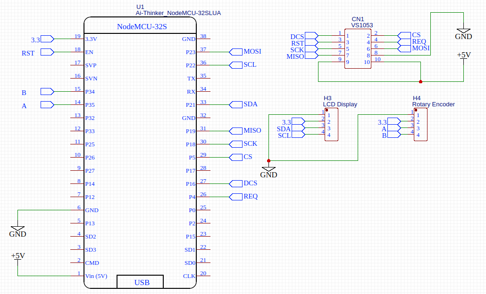
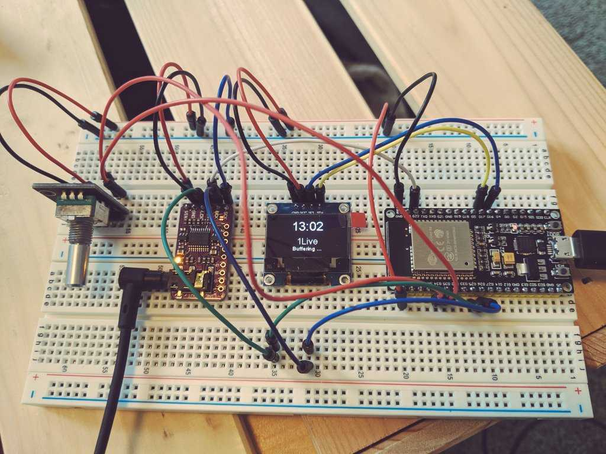
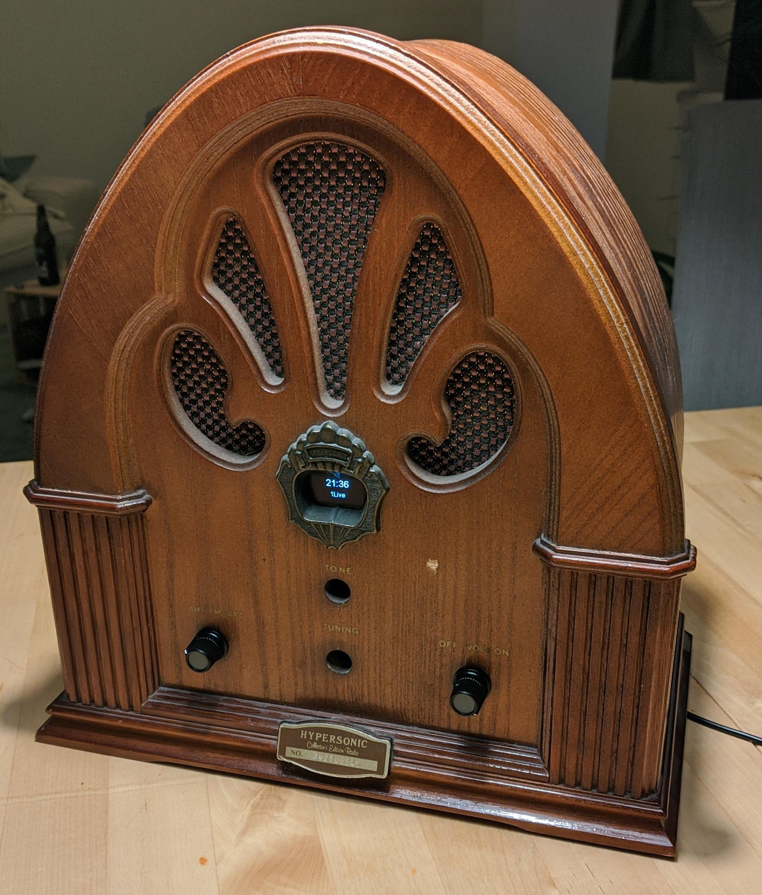

ESP32 Webradio 

==============

This is a simple ESP32 webradio implementation based on the Arduino framework build with PlatformIO.

TODOs
-----

- [x] Received all parts
- [x] Connect ESP32 with DAC
- [x] Play simple mp3 stream on ESP32 with I2S
- [x] Verify if VS1053 is more feasable
- [x] Implement rotary encoder input
- [x] Attatch Display via I2C
- [x] Design and implement simple menu
- [x] Solder custom PCB design
- [x] Attatch Potentiometer with switch
- [x] Build Hardware into Vintage enclosure

Partlist
--------

This parts are used for my personal web radio project setup into a vintage enclosure.

| Name             | Price |
|------------------|-------|
| ESP32 dev board  | 10,00€ | 
| OLED I2C Display |  7,10€ | 
| (I2S DAC PCM5102) |  6,50€ |  
| SPI VS1053 Decoder  |  4,50€ |  
| Potentiomenter   |  3,00€ |
| Rotary Encoder   |  3,00€ |

Setup
-----

