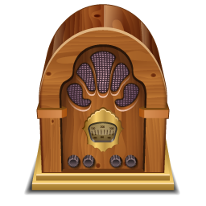

ESP32 Webradio 

==============

This is a simple ESP32 webradio implementation based on the Arduino framework build with PlatformIO.

> Work in Progress!

TODOs
-----

- [ ] Received all parts
- [ ] Connect ESP32 with DAC
- [ ] Play simple mp3 stream on ESP32 with I2S
- [ ] Verify if VS1053 is more feasable
- [ ] Implement rotary encoder input
- [ ] Attatch Display via I2C
- [ ] Design and implement simple menu
- [ ] Attatch Potentiometer with switch
- [ ] Build Hardware into Vintage enclosure

Partlist
--------

This parts are used for my personal web radio project setup into a vintage enclosure.

| Name             | Price |
|------------------|-------|
| ESP32 dev board  | 10,00€ | 
| OLED I2C Display |  7,10€ | 
| I2S DAC PCM5102  |  6,50€ |  
| Potentiomenter   |  3,00€ |
| Rotary Encoder   |  3,00€ |

